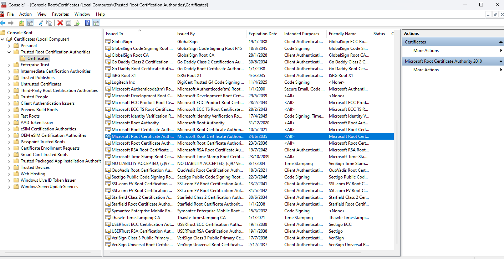

# Simple Generative AI Powered Applications

Repository containing codebase covering various GenAI module applications based on "Building Generative AI-Powered Applications with Python" Coursera Course organised by IBM. 

1. Image Captioning
    - Gradio Interface UI for uploading image to perform captioning
    - Python script for generating captions on all available images retrieved from a specified UI.

2. Simple Chatbot
    - Frontend interface supported by HTML, Javascript and Flask
    - Backend chat service supported by the use of HuggingFaceHub model loaded into PC.

## Environment file to edit

Please create an *.env* file with the following parameters.

```
HUGGINGFACEHUB_API_TOKEN = <Your HuggingFaceHub API Token>
BLIP_MODEL_NAME = "Salesforce/blip-image-captioning-large"

# Required if automate_url_caption.py script is run.
IMAGES_SOURCE_URL = <URL containing images>
PYTHONPATH = <Path to this repository which is downloaded>
MODEL_MAX_TOKEN = <Max token allowed for LLM completion for all LLM models> 

# Condition defining captions to be generated for images above specific resolution
MIN_RES_PIXELS = <Number of images pixels required to allow captions to be generated>

# Required if you are running *imagecaptioning.py* under *ImageCaption/* folder
VISUALQA_IMAGE_FILENAME = <Files under *images* subfolder> #E.g. "demo_image.jpg" 

# For Image classification **(Required if you are running the gradio_image_classification.py for image classification models)**
TORCH_HUB_MODEL_DIRECTORY = "pytorch/vision:v0.6.0"
TORCH_HUB_MODEL_NAME = <Torch Hub Model name> #E.g resnet18

# For Chatbot. Please select a model that can be executed on your computer.
CHATBOT_MODEL_NAME = "facebook/blenderbot-400M-distill"

# Gradio Config for Server and Port.
GRADIO_SERVER_NAME = <Name of DNS Resolvable Server or IP Address> # Eg "127.0.0.1"
GRADIO_SERVER_PORT = <Your preferred port> #E.g "7860"

# FLASK CONFIG. SERVER_NAME DEFAULTS TO 127.0.0.1 if empty. SERVER_PORT DEFAULTS to 5000 if empty.
FLASK_RUN_HIST = <Host Name/IP> # Eg "127.0.0.1"
FLASK_RUN_PORT = <Your preferred port> #E.g "7860"
```

Corresponding Javascipt to be edited (For chatbot app only)

```
async function makePostRequest(msg) {
    const url = "http://<Flask Server Name>:<Port>/chatbot";  // Make a POST request to this url
    const requestBody = {
      prompt: msg
    };
```

## Installation and execution

Please use Anaconda distribution to install the necessary libraries with the following command

```
conda env create -f environment.yml
```

Upon installation and environment exectuion, please run the relevant command based on the app required to run.

### 1. Image Captioning

```
cd ImageCaption/
python run_gradio_image_upload_captioning.py
```

You should see a Gradio UI as follows:


**A working example with generated caption**


** For experimentation purpose with caption models generated output without Gradio **

Please run the following command in the repository main folder

```
cd ImageCaption/
python imagecaptioning.py
```

### 2. Simple Chatbot

Suggested chatbot model from HuggingFace that can be loaded on to your PC would be *facebook/blenderbot-400M-distill*. It is known to outperforms existing models in terms of longer conversations over multiple sessions and is more knowledgeable and has more factual consistency, according to human evaluators. (Source: [ParlAI](https://parl.ai/projects/blenderbot2/#:~:text=A%20chatbot%20with%20its%20own,consistency%2C%20according%20to%20human%20evaluators.))

**Disclaimer: You may need to configure *TEMPERATURE* environment to control chatbot responses. As this is just a simple project, the chatbot is not meant to be provide perfectly great responses and the result of such is largely dependent on the input chat message provided and other model configurations.**

```
cd Chatbot/
python app.py
```

OR
```
cd Chatbot/
flask run -h <host Name/IP> -p <port>
```

You should see a sample chatbot interface below:


A demonstration example of how conversation would be like:


To terminate program, press 'Ctrl' + 'C'.

**Testing of chatbot response with curl**
Ensure that you have executed above command to get flask running. Then execute an example command below

```
curl -X POST -H "Content-Type: application/json" -d '{"prompt": "Hello, how are you today?"}' <Flask Server Host>:<Port>/chatbot
```
## 3. Voice Assistant

### 3.1 Place RootCA cert in the certs folder

This is a prerequisite for docker build process listed in 3.2.

If you are in Linux machine, do the following
```
cp /usr/local/share/ca-certificates/rootCA.crt /home/project/chatapp-with-voice-and-openai/certs/
```

For Windows, refer to the steps for extracting certificates.

RootCA extraction steps for Windows reference:
(https://help.zscaler.com/deception/exporting-root-ca-certificate-active-directory-certificate-service)

In particular, the specific cert required is illustrated below

The cert to export is highlighted below:


### 3.2 Run docker image with the following (build/rebuild if needed)

Ensure that your docker engine is active.

```
docker build . -t voice-chatapp-powered-by-openai
docker run -p 8000:8000 voice-chatapp-powered-by-openai
```


## Programming languages/tools involved
- Python
- JavaScript
- Flask
- Gradio
    - Interface
    - Textbox
    - Image
- HuggingFace
    - Transformer models involving BlipProcessor, BlipForConditionalGeneration
- Concurrence library
    - Multiprocessing with 10 threads for image captioning
        - 14 images took 254 seconds

## Acknowledgement and Credits

The codebase for the simple apps developed are referenced from *"Building Generative AI-Powered Applications with Python"* by IBM available at https://www.coursera.org/learn/building-gen-ai-powered-applications.

Additional acknowledgement for different sections:

Chatbot module webpage template: [IBM's LLM Application Chatbot Github Repository](https://github.com/ibm-developer-skills-network/LLM_application_chatbot)

Voice assistant webpage template: [Arora-R](https://github.com/arora-r/chatapp-with-voice-and-openai-outline)

RootCert Export: [RootCert-Export steps for Windows](https://help.zscaler.com/deception/exporting-root-ca-certificate-active-directory-certificate-service)