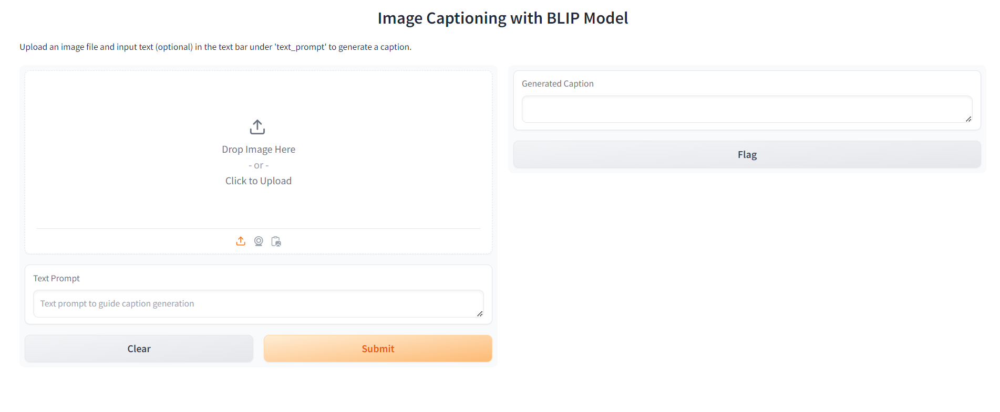
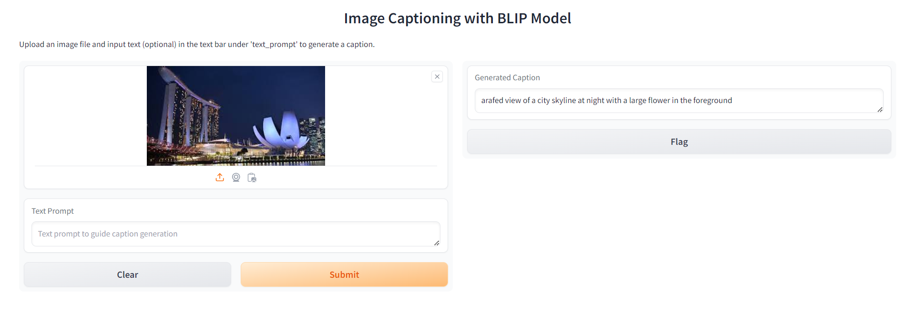

# Simple Generative AI Powered Applications

Repository containing codebase covering various GenAI apps based on "Building Generative AI-Powered Applications with Python" Coursera Course organised by IBM. 

- Image Captioning via Gradio Interface
- Image Captioning on images retrieved from a specified URL.

## Environment file to edit

Please create an *.env* file with the following parameters.

```
HUGGINGFACEHUB_API_TOKEN = <Your HuggingFaceHub API Token>
BLIP_MODEL_NAME = "Salesforce/blip-image-captioning-large"

# Required if automate_url_caption.py script is run.
IMAGES_SOURCE_URL = <URL containing images>
PYTHONPATH = <Path to this repository which is downloaded>

# Condition defining captions to be generated for images above specific resolution
MIN_RES_PIXELS = "400"

# Required if you are running *ImageCaptioning.py* under *Transformer_BLIP/* folder
VISUALQA_IMAGE_FILENAME = "demo_image.jpg"

# For Image classification **(Required if you are running the gradio_image_classification.py for image classification models)**
TORCH_HUB_MODEL_DIRECTORY = "pytorch/vision:v0.6.0"
TORCH_HUB_MODEL_NAME = "resnet18"
MODEL_MAX_TOKEN = "300"

# Gradio Config for Server and Port.
GRADIO_SERVER_NAME = <Name of DNS Resolvable Server or IP Address> # Eg "127.0.0.1"
GRADIO_SERVER_PORT = <Your preferred port> # Eg "7860"
```

For more information on Langsmith, refer to https://www.langchain.com/langsmith

## Installation and execution

Please use Anaconda distribution to install the necessary libraries with the following command

```
conda env create -f environment.yml
```

Upon installation and environment exectuion, run the following command to start Gradio interface.

```
python gradio_image_captioning.py
```

You should see a Gradio UI as follows:



**A working example with generated caption**



### For experimentation purpose with caption models generated output without Gradio

Please run the following command in the repository main folder

```
python Transformer_BLIP/ImageCaptioning.py
```

## Programming languages/tools involved
- Python
- Gradio
    - Interface
    - Textbox
    - Image
- HuggingFace
    - Transformer models involving BlipProcessor, BlipForConditionalGeneration

## Acknowledgement and Credits

The codebase for the simple apps developed are referenced from *"Building Generative AI-Powered Applications with Python"* by IBM available at https://www.coursera.org/learn/building-gen-ai-powered-applications.