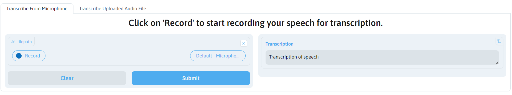
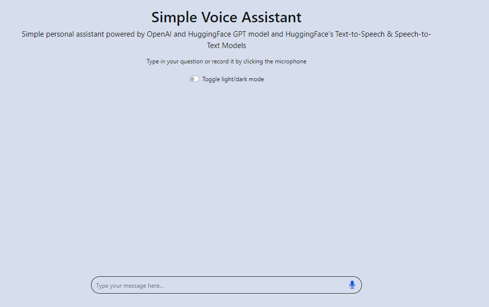

# Simple Generative AI Powered Applications

Repository containing codebase covering various GenAI module applications based on "Building Generative AI-Powered Applications with Python" Coursera Course organised by IBM. 

1. Image Captioning
    - Gradio Interface UI for uploading image to perform captioning
    - Python script for generating captions on all available images retrieved from a specified UI.

2. Simple Chatbot
    - Frontend interface supported by HTML, Javascript and Flask scripts
    - Backend chat service supported by the use of HuggingFaceHub model loaded into PC.

3. Voice Assistant Chatbot
    - Frontend interface supported by HTML, Javascript and Flask scripts
    - Backend chat service supported by the use of Speech-to-Text, Text-to-Speech and OpenAI Chat Models

## Environment file to create and edit

The *.env* file containing environment variables will be referenced by all modules in this repo. Here are the default settings for quickstart.

Please enter your API Token keys, change model names are other configurations where necessary for other experimentation needs

```
OPENAI_API_KEY = <YOUR API TOKEN>
OPENAI_MAX_TOKEN = "4000"
OPENAI_MODEL_NAME = "gpt-3.5-turbo"
HUGGINGFACEHUB_API_TOKEN = <YOUR API TOKEN>
PYTHONPATH = <REPOSITORY PATH>

# For Image Captioning
BLIP_MODEL_NAME = "Salesforce/blip-image-captioning-large"
VISUALQA_IMAGE_FILENAME = "demo_image.jpg" ## For imagecaptioning.py use
IMAGES_SOURCE_URL = "https://en.wikipedia.org/wiki/IBM" ## For automate_url_caption.py use
MIN_RES_PIXELS = "400" ## As long it is positive
MODEL_CAPTION_MAX_TOKEN = "300" ## As long it is positive

# For Chatbot. Please select a relevant HuggingFace model that can fit and run on your computer.
CHATBOT_MODEL_NAME = "facebook/blenderbot-400M-distill"
CHATBOT_MODEL_TEMPERATURE = "0.8" # Anything above 0 but less than 1
CHATBOT_MODEL_MAX_LENGTH = "80"

# For VoiceAssistant. Refer to STT models, https://huggingface.co/models?pipeline_tag=automatic-speech-recognition and TTS models page at https://huggingface.co/models?pipeline_tag=text-to-speech

## For long form transcription, please use "distil-whisper/distil-large-v3". STT Config here
HUGGINGFACE_STT_MODEL_NAME = "openai/whisper-small"
HUGGINGFACE_STT_MODEL_MAX_TOKEN = "128"
HUGGINGFACE_STT_MODEL_TEMPERATURE = "0.0"

## TTS Config here.
HUGGINGFACE_TTS_MODEL_NAME  = "microsoft/speecht5_tts"
TTS_API_CALL_ENABLED = "0" # will route tts model use to above. Other value will mean offline inference

# Gradio Config for Server and Port.
GRADIO_SERVER_NAME = <Name of DNS Resolvable Server or IP Address> #E.g "127.0.0.1"
GRADIO_SERVER_PORT = <Your preferred port> #E.g "7860"

# FLASK CONFIG. SERVER_NAME DEFAULTS TO 127.0.0.1 if empty. SERVER_PORT DEFAULTS to 5000 if empty.
FLASK_RUN_HIST = <Host Name/IP> #E.g "127.0.0.1"
FLASK_RUN_PORT = <Your preferred port> #E.g "7860"
```

Corresponding Javascipt to be edited (For chatbot app only)

```
async function makePostRequest(msg) {
    const url = "http://<Flask Server Name>:<Port>/chatbot";  // Make a POST request to this url
    const requestBody = {
      prompt: msg
    };
```

## Installation and execution

Please use Anaconda distribution to install the necessary libraries with the following command

```
conda env create -f environment.yml
```

Upon installation and environment exectuion, please run the relevant command based on the app required to run.

### 1. Image Captioning

```
cd ImageCaption/
python run_gradio_image_upload_captioning.py
```

You should see a Gradio UI as follows:


**A working example with generated caption**


** For experimentation purpose with caption models generated output without Gradio **

Please run the following command in the repository main folder

```
cd ImageCaption/
python imagecaptioning.py
```

### 2. Simple Chatbot

Suggested chatbot model from HuggingFace that can be loaded on to your PC would be *facebook/blenderbot-400M-distill*. It is known to outperforms existing models in terms of longer conversations over multiple sessions and is more knowledgeable and has more factual consistency, according to human evaluators. (Source: [ParlAI](https://parl.ai/projects/blenderbot2/#:~:text=A%20chatbot%20with%20its%20own,consistency%2C%20according%20to%20human%20evaluators.))

**Disclaimer: You may need to configure *TEMPERATURE* environment to control chatbot responses. As this is just a simple project, the chatbot is not meant to be provide perfectly great responses and the result of such is largely dependent on the input chat message provided and other model configurations.**

```
cd Chatbot/
python app.py
```

OR
```
cd Chatbot/
flask run -h <host Name/IP> -p <port>
```

You should see a sample chatbot interface below:


A demonstration example of how conversation would be as follows:


To terminate program, press 'Ctrl' + 'C'.

**Testing of chatbot response with curl**
Ensure that you have executed above command to get flask running. Then execute an example command below

```
curl -X POST -H "Content-Type: application/json" -d '{"prompt": "Hello, how are you today?"}' <Flask Server Host>:<Port>/chatbot
```
## 3. Voice Assistant


### 3A. Simple transcription service with OpenAI model experimentation setup via Gradio Frontend

You may can either upload your own mp3 file or use a sample mp3 file provided which are sourced from the following links:

1) **Archived LiveATC Recordings** [link](https://www.liveatc.net/recordings.php) - Expect poor performance due to background noise 

2) **Ted Talks Daily Trailer** [link](https://audiocollective.ted.com/#shows-1) - Expect good performance due to clear audio, without background noise.


To run, execute the following command in the repository

```
cd VoiceAssistant/experimentations
python gradio_interface.py
```

Access the Gradio Interface via the host IP/Port specified and you should see a frontend like below:


Sample audio transcription from file:


Disclaimer: Do expect transcription in accuracies as results are largely dependent on the quality and length of audio file provided.  

### 3B. Simple VoiceAssistant application

**Disclaimer: HuggingFaceHub Model inference endpoint may not be available at times. As such, you may want to experiment with text to speech models offline by setting the environment variables as follows:
```
TTS_API_CALL_ENABLED = "0"
**
and 
Run the following command to start the Flask service

```
python run VoiceAssistant/server.py
```

Access the Flask Interface via the host IP/Port specified and you should see a frontend like below:



## Programming languages/tools involved
- Python
- JavaScript
- Flask
- Gradio
    - Interface
    - Textbox
    - Image
- HuggingFace
    - Transformer models involving BlipProcessor, BlipForConditionalGeneration
- Concurrence library
    - Multiprocessing with 10 threads for image captioning
        - 14 images took 254 seconds

## Acknowledgement and Credits

The codebase for the simple apps developed are referenced from *"Building Generative AI-Powered Applications with Python"* by IBM available at https://www.coursera.org/learn/building-gen-ai-powered-applications.

Additional acknowledgement for different sections:

Chatbot module webpage template: [IBM's LLM Application Chatbot Github Repository](https://github.com/ibm-developer-skills-network/LLM_application_chatbot)

Voice assistant webpage template: [Arora-R](https://github.com/arora-r/chatapp-with-voice-and-openai-outline)

RootCert Export: [RootCert-Export steps for Windows](https://help.zscaler.com/deception/exporting-root-ca-certificate-active-directory-certificate-service)

OpenAI Speech to text: [Speech-to-text](File uploads are currently limited to 25 MB and the following input file types are supported: mp3, mp4, mpeg, mpga, m4a, wav, and webm)