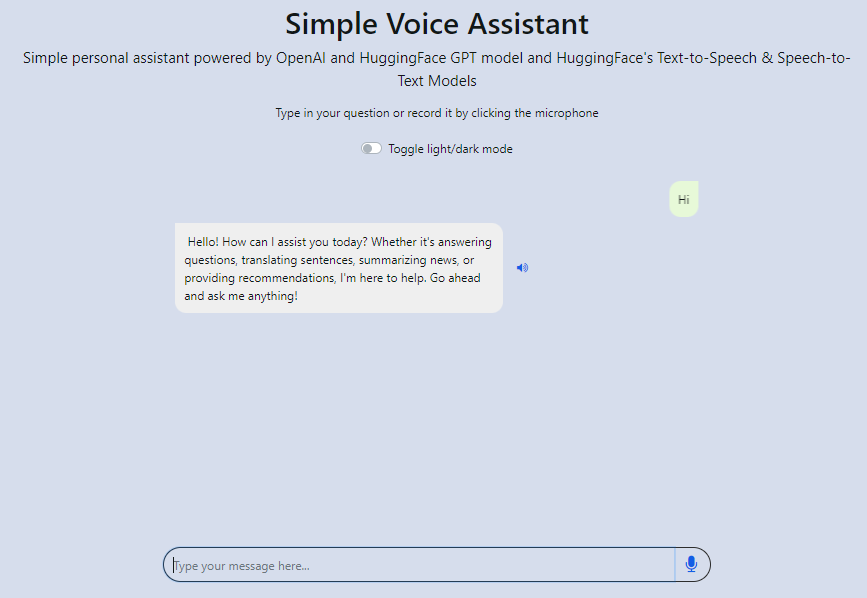

# Simple Generative AI Powered Applications

Repository containing codebase covering various GenAI module applications based on "Building Generative AI-Powered Applications with Python" Coursera Course organised by IBM. 

1. Image Captioning
    - Gradio Interface UI for uploading image to perform captioning
    - Python script for generating captions on all available images retrieved from a specified UI.

2. Simple Chatbot
    - Frontend interface supported by HTML, Javascript and Flask scripts
    - Backend chat service supported by the use of HuggingFaceHub model loaded into PC.

3. Voice Assistant Chatbot
    - Frontend interface supported by HTML, Javascript and Flask scripts
    - Backend chat service supported by the use of Speech-to-Text, Text-to-Speech and OpenAI Chat Models

## Environment file to create and edit

The *.env* file containing environment variables will be referenced by all modules in this repo. Here are the default settings for quickstart.

Please enter your API Token keys, change model names are other configurations where necessary for other experimentation needs

```
OPENAI_API_KEY = <Your API KEY>
OPENAI_MAX_TOKEN = "4000"
OPENAI_MODEL_NAME = "gpt-3.5-turbo"
HUGGINGFACEHUB_API_TOKEN = <Your API KEY>
PYTHONPATH="C:\Users\quekz\OneDrive\Desktop\Building_Generative_AI_Powered_Applications_IBM"
PYTHONDONTWRITEBYTECODE="1"

# For Image Captioning
BLIP_MODEL_NAME = "Salesforce/blip-image-captioning-large"
# For imagecaptioning.py use
VISUALQA_IMAGE_FILENAME = "demo_image.jpg"
# For automate_url_caption.py use
IMAGES_SOURCE_URL = "https://en.wikipedia.org/wiki/IBM"

# min image resolution to process
MIN_RES_PIXELS = "400"
# max token for caption
MODEL_CAPTION_MAX_TOKEN = "300"

# For Chatbot. Please select a relevant HuggingFace model that can fit and run on your computer.
CHATBOT_MODEL_NAME = "facebook/blenderbot-400M-distill"
 # Anything above 0 but less than 1. A float value
CHATBOT_MODEL_TEMPERATURE = "0.8"
# Chatbot max length generation. Must be positive integer.
CHATBOT_MODEL_MAX_LENGTH = "80"

# For VoiceAssistant. Refer to STT models, https://huggingface.co/models?pipeline_tag=automatic-speech-recognition and TTS models page at https://huggingface.co/models?pipeline_tag=text-to-speech

## For long form transcription, please use "distil-whisper/distil-large-v3". STT Config here.
HUGGINGFACE_STT_MODEL_NAME = "distil-whisper/distil-large-v3"

# Config for using openAPI Chatmodels. Indicate a string value to enable.
OPENAPI_CHATMODEL_API_CALL_ENABLED = ""

## TTS Config here. Model example #"microsoft/speecht5_tts or suno/bark-small"
HUGGINGFACE_TTS_MODEL_NAME = "suno/bark-small"
HUGGINGFACE_TTS_MODEL_TEMPERATURE = "0.0"

# Config for using HuggingFace TTS API calls. Indicate a string value to enable.call.
TTS_API_CALL_ENABLED = ""

# Gradio Config for GRADIO_SERVER_NAME DEFAULTS TO 127.0.0.1 if empty. GRADIO_SERVER_PORT DEFAULTS to 7860 if empty.
GRADIO_SERVER_NAME = "127.0.0.1"
GRADIO_SERVER_PORT = "7860"

# FLASK CONFIG. FLASK_RUN_HIST DEFAULTS TO 127.0.0.1 if empty. FLASK_RUN_PORT DEFAULTS to 5000 if empty.
FLASK_RUN_HIST = "127.0.0.1"
FLASK_RUN_PORT = "5001"
```

Corresponding Javascipt to be edited (For chatbot app only)

```
async function makePostRequest(msg) {
    const url = "http://<Flask Server Name>:<Port>/chatbot";  // Make a POST request to this url
    const requestBody = {
      prompt: msg
    };
```

## Installation and execution

Please use Anaconda distribution to install the necessary libraries with the following command

```
conda env create -f environment.yml
```

Upon installation and environment exectuion, please run the relevant command based on the app required to run.

### 1. Image Captioning

```
cd ImageCaption/
python run_gradio_image_upload_captioning.py
```

You should see a Gradio UI as follows:


**A working example with generated caption**


** For experimentation purpose with caption models generated output without Gradio **

Please run the following command in the repository main folder

```
cd ImageCaption/
python imagecaptioning.py
```

### 2. Simple Chatbot

Suggested chatbot model from HuggingFace that can be loaded on to your PC would be *facebook/blenderbot-400M-distill*. It is known to outperforms existing models in terms of longer conversations over multiple sessions and is more knowledgeable and has more factual consistency, according to human evaluators. (Source: [ParlAI](https://parl.ai/projects/blenderbot2/#:~:text=A%20chatbot%20with%20its%20own,consistency%2C%20according%20to%20human%20evaluators.))

**Disclaimer: You may need to configure *TEMPERATURE* environment to control chatbot responses. As this is just a simple project, the chatbot is not meant to be provide perfectly great responses and the result of such is largely dependent on the input chat message provided and other model configurations.**

```
cd Chatbot/
python app.py
```

OR
```
cd Chatbot/
flask run -h <host Name/IP> -p <port>
```

You should see a sample chatbot interface below:


A demonstration example of how conversation would be as follows:


To terminate program, press 'Ctrl' + 'C' in your terminal.

**Testing of chatbot response with curl**
Ensure that you have executed above command to get flask running. Then execute an example command below:

```
curl -X POST -H "Content-Type: application/json" -d '{"prompt": "Hello, how are you today?"}' <Flask Server Host>:<Port>/chatbot
```
## 3. Simple VoiceAssistant application

This is a UI powered VoiceAssistant application that enables you to chat with a Chatbot via text or audio inputs.

Run the following command to start the Flask service front end directly from the repo root directory.

```
python run VoiceAssistant/server.py
```

Access the Flask Interface via the host IP/Port specified and you should see a frontend as follows:


A working chat version with text input and generated output(with audio) is as shown below


A working chat version with transcribed input and generated output(with audio) is as shown below


Generated audio files are found in *bot_audio/* folder during execution of the repo.

**Disclaimer and limitations**

1. HuggingFaceHub Model inference endpoint may not be available at times. As such, you may want to experiment with text to speech models offline by setting the environment variables as follows:
```
TTS_API_CALL_ENABLED = ""
**
```

2. As this is a technical exploration/experimentation work, Audio transcription may be inaccurate or up to expectations. You may randomy encounter the following error as a result of converting audio inputs to numerical values for transcription due to short speech or interference from surrounding:
```
ValueError: buffer size must be a multiple of element size
```

3. The chatbot has no memory embedded, so it does not follow up or has any clue with previous conversation(s).

4. The following models are tested to work with codebase:
    - STT model: distil-whisper/distil-large-v3
    - Text generation: OpenAI Chat models and mistralai/Mixtral-8x7B-Instruct-v0.1 model
    - TTS models: Microsoft's SpeechT5 and Suno/Bark model variants

### 4. Speech Transcription Summarizer

This is a simple Gradio UI Powered Speech Transcription tool that serves to summarise a an uploaded meeting speech file which is to be transcribed powered by LLM models involving "distil-whisper/distil-large-v3 model" for transcription and Meta's "meta-llama/Llama-2-7b-chat-hf" LLM model for summarsing transcribed speech.


A sample IBM meeting speech audio file is provided under the folder *sample_mp3_files* folder.

To run, please execute the following command
```
python Speech_Summarizer/speech_analyzer_with_gradio.py
```

You should see a UI as shown below. To test out, please upload the provided audio file.


Sample audio file transcription from file:


**Disclaimer and limitations**

1. Do expect transcription inaccuracies/cutoff as results are largely dependent on the quality and length of audio file provided.  

You may can either upload your own mp3 file or use a sample mp3 file provided sourced from the following links:

    - **Ted Talks Daily Trailer** [link](https://audiocollective.ted.com/#shows-1) - 

    - **IBM Sample Voice mp3 file** [link](https://cf-courses-data.s3.us.cloud-object-storage.appdomain.cloud/IBMSkillsNetwork-GPXX04C6EN/Testing%20speech%20to%20text.mp3)

2. There is no async/await implementation for the process, so outputs would take sometime to generate.

## Programming languages/tools involved
- Python
- HTML/CSS/Javascript (files provided by course, with some edits)
- Flask
- Gradio
    - Interface
    - Textbox
    - Image
- HuggingFace
    - Transformer models: 
        - Text-to-speech: *Suno/Bark*, *Microsoft SpeechT5*
        - Text generation: OpenAI GPT-3.5 and GPT-4.0 Chat models, *mistralai/Mixtral-8x7B-Instruct-v0.1*, *meta-llama/Llama-2-7b-chat-hf*
        - Speech-to-text: *distil-whisper/distil-large-v3*
        - Image Captioning: *Salesforce/blip-image-captioning-large*
    - HuggingFace pipeline,
- Concurrence library
    - Multiprocessing with 10 threads for image captioning
        - 14 images took 254 seconds


## Troubleshooting notes/ Gradio errors that does not affect functionality

1. To support symlinks on Windows, you either need to activate Developer Mode or to run Python as an administrator. In order to see activate developer mode, see this article: https://docs.microsoft.com/en-us/windows/apps/get-started/enable-your-device-for-development


2. Gradio reporting *RuntimeError: Response content longer than Content-Length* when performing file upload through Gradio Interface in IDE. This does not affect the necessary transcription and summarisation flow of "4.Speech Transcription Summarizer."

3. Gradio reporting *PermissionError: [Errno 13] Permission denied: < Temp file directory > when performing file upload through Gradio Interface in IDE. This does not affect the necessary transcription and summarisation flow of "4.Speech Transcription Summarizer." This can be resolved by executing with admin rights.


## Acknowledgement and Credits

The codebase for the simple apps developed are referenced from *"Building Generative AI-Powered Applications with Python"* by IBM available at https://www.coursera.org/learn/building-gen-ai-powered-applications.

Additional acknowledgement for different sections:

- Chatbot module:
    - Webpage template: [IBM's LLM Application Chatbot Github Repository](https://github.com/ibm-developer-skills-network/LLM_application_chatbot)

- Voice assistant module:
    - Frontend template: [Arora-R](https://github.com/arora-r/chatapp-with-voice-and-openai-outline)

    - Transcription processing for input speech audio as part of speech-to-text function in VoiceAssistant [Transcribe demo](https://github.com/davabase/whisper_real_time/blob/master/transcribe_demo.py)

- Speech Summarizer:
    - Llama2 prompt structure discussion: [PromptTemplateStructure](https://discuss.huggingface.co/t/trying-to-understand-system-prompts-with-llama-2-and-transformers-interface/59016/8)

- Build Chatbot For your data module
    - Frontend template: [BuildChatbotForYourData](https://github.com/sinanazeri/build_own_chatbot_without_open_ai.git)